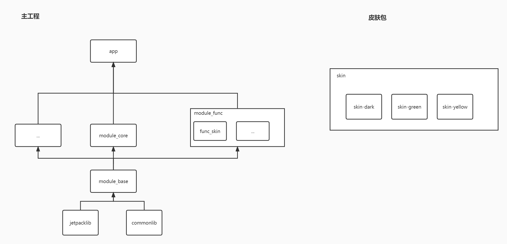
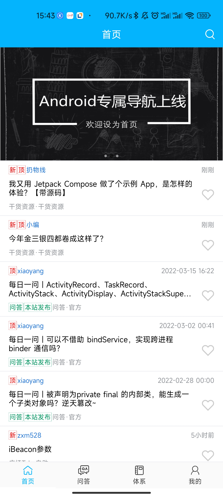
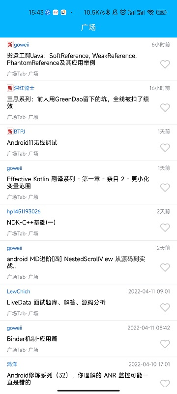
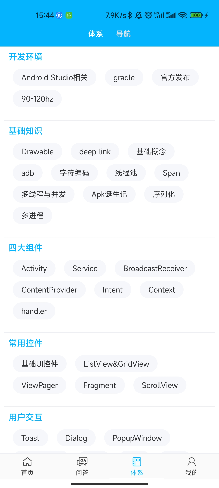
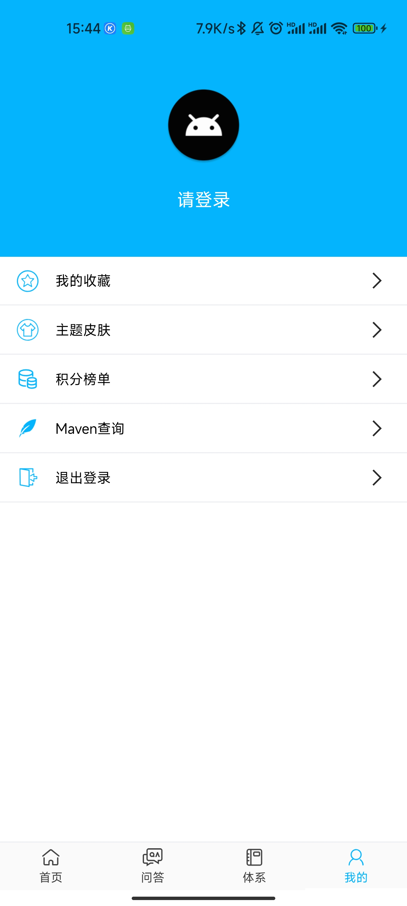
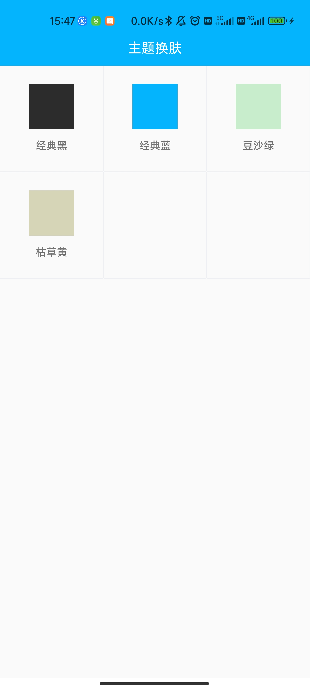
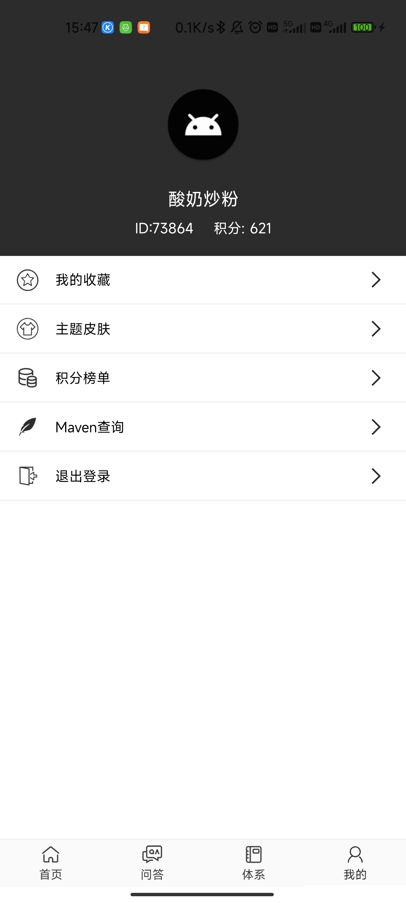
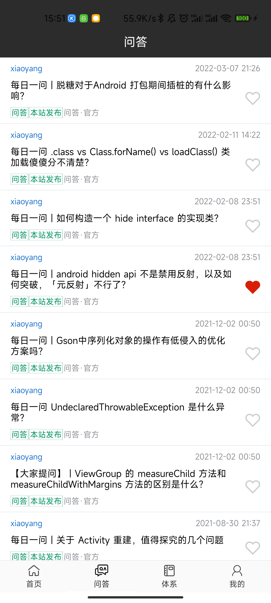

# LWanAndroid

## 简介

本项目基于 [WanAndroid](https://www.wanandroid.com/) 开放 API，主要用于学习和实践 Jetpack、多模块架构、Gradle 插件与 ASM 字节码处理等能力。

WanAndroid 官方开源项目地址：
<https://github.com/hongyangAndroid/wanandroid>

## 项目概况

1. 整体采用 MVVM 架构，并以组件化、多模块方式组织代码。
2. 工程中包含对 Gradle 插件和 ASM 的实践，覆盖方法耗时插桩、Application/Activity 基类替换等构建期能力。
3. 工程保留了 Gradle 插件和 ASM 的历史实践代码，当前默认构建链路已不再启用 Booster。

### 技术栈

- DataBinding
- ViewModel
- Paging 3
- Room
- [Glide](https://github.com/bumptech/glide)
- [Android-skin-support](https://github.com/ximsfei/Android-skin-support)
- [ARouter](https://github.com/alibaba/ARouter)
- [Retrofit](https://square.github.io/retrofit/)
- Kotlin 与协程
- CardView
- [Banner](https://github.com/youth5201314/banner)

### 其他实践点

- MVVM 分层
- Kotlin 扩展函数封装
- 网络层封装
- Flow

## 项目结构

## 项目截图

|  |  |  |  |
| --- | --- | --- | --- |
|  |  |  |  |

## 版本迭代

### 1.0.0

- 首页文章与 Banner
- 文章搜索
- 问答列表
- 体系与导航列表
- 个人中心、注册登录
- 收藏与点赞
- Maven 查询
- 广场
- 换肤功能

## TODO

- [x] 换肤功能
- [ ] 积分榜单
- [ ] Compose 试验
- [ ] 体验优化
