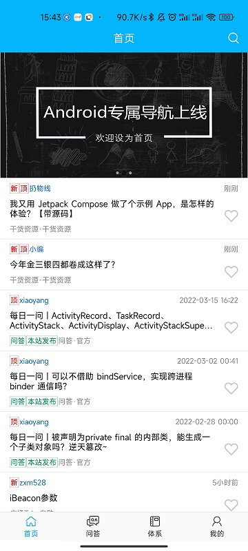
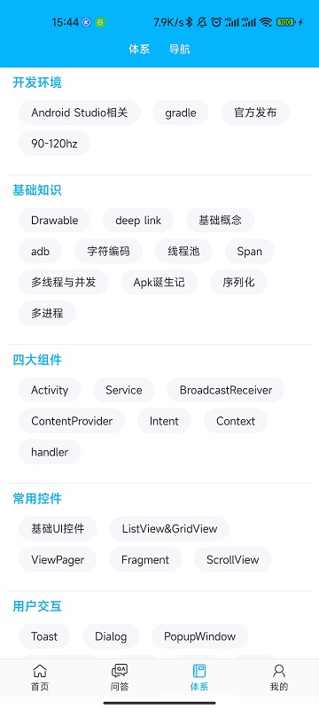
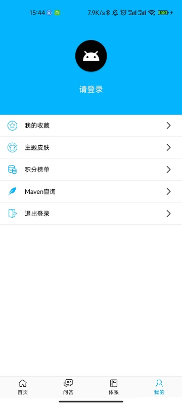
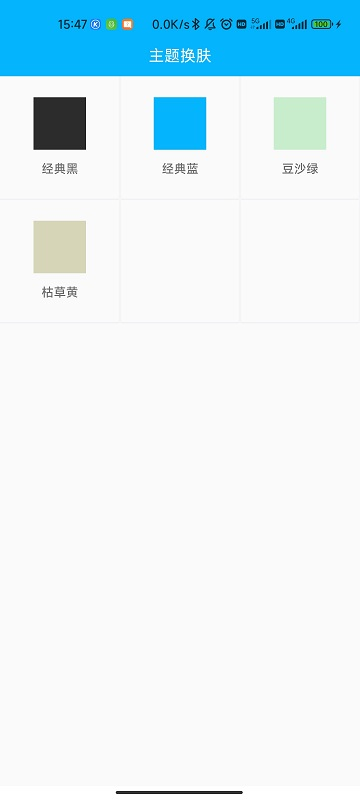
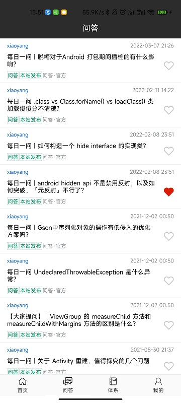

# LWanAndroid

## 简介

本项目是基于 [玩安卓](https://www.wanandroid.com/) 开放API，对Jetpack、Gradle插件以及一些流行框架进行学习封装。鸿洋大佬的玩安卓官方项目地址：https://github.com/hongyangAndroid/wanandroid

## 项目概况

1. 整体框架使用MVVM架构，并以组件化形式分层，优先使用官方推荐的jetpack库
2. 对Gradle插件以及ASM进行了简单实践，包括简单的方法耗时插桩、动态替换Application继承类，并接入了[booster](https://github.com/didi/booster) 框架实现了根据换肤功能是否开启而实现替换Activity父类

### 技术框架（MVVM）

- Databinding
- Viewmodel
- Paging3
- Room
- [Glide](https://github.com/bumptech/glide)
- [Android-skin-support](https://github.com/ximsfei/Android-skin-support)
- [ARouter](https://github.com/alibaba/ARouter)
- [booster](https://github.com/didi/booster)
- [Retrofit](http://square.github.io/retrofit/)
- kotlin以及协程
- [CardView](https://developer.android.com/reference/android/support/v7/widget/CardView.html)
- [banner](https://github.com/youth5201314/banner)
- ...

### 其他技术点

- MVVM
- kotlin高阶函数与拓展函数封装
- 网络框架封装
- flow
- ...

## 项目架构

## 项目截图
|  |  |  |  |
| --- | --- | --- | --- |
|  |  |  |  |

## 版本更新和TODO

###  版本迭代

#### 1.0.0 

> - 首页文章、banner
> - 文章搜索
> - 问答列表
> - 体系、导航列表
> - 个人中心、注册登录
> - 收藏点赞
> - Maven查询
> - 广场
> - 换肤功能

### TODO
- [x] 换肤功能
- [ ] 积分榜单
- [ ] Compose试验
- [ ] 体验优化

